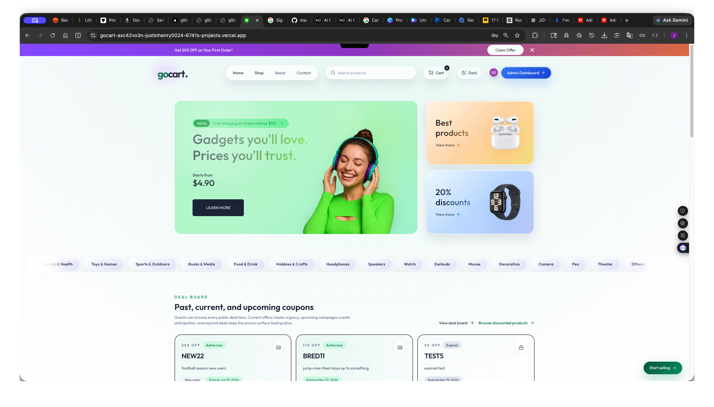
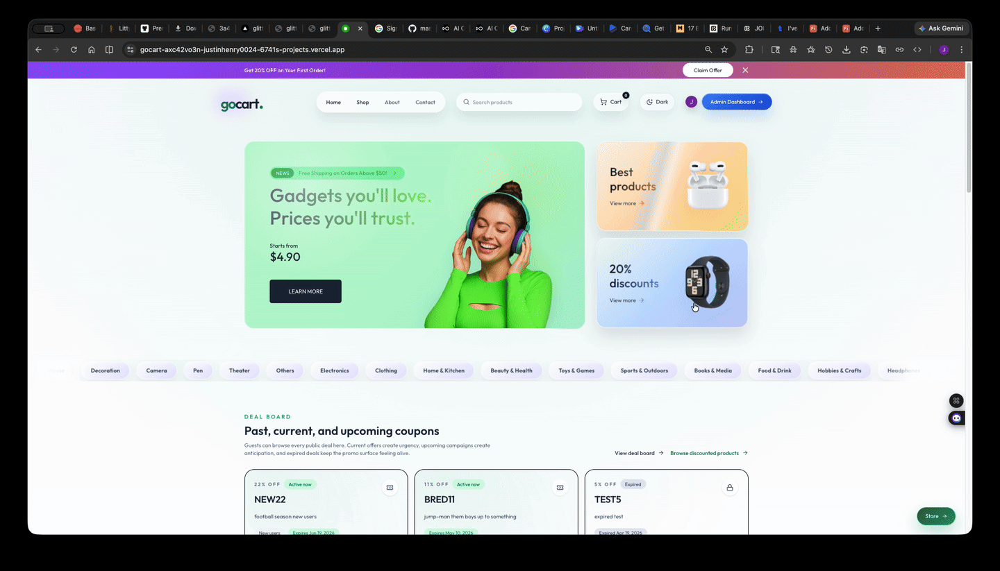
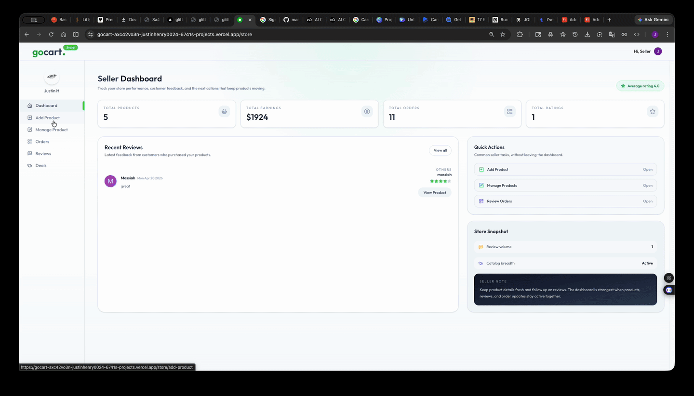
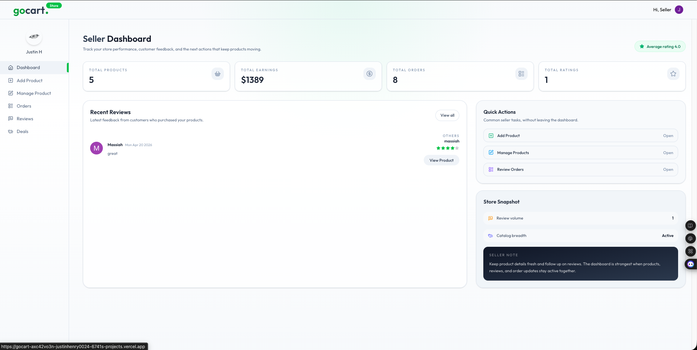
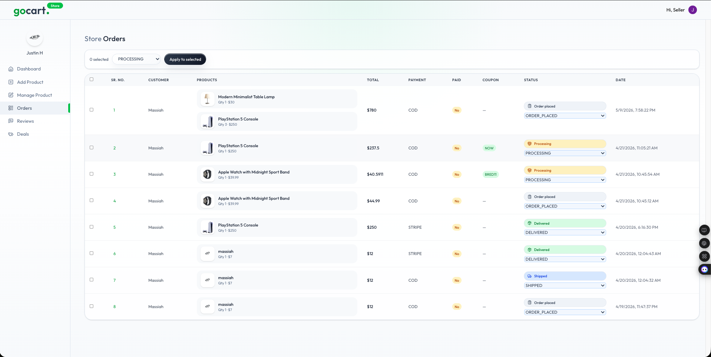
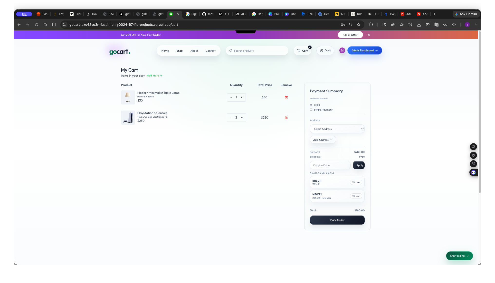

# GoCart

GoCart is a full-stack, multi-vendor ecommerce platform I built to feel like a real product, rather then a basic storefront demo. It combines customer shopping flows, seller tools, admin controls, payments, reviews, coupons, account-aware UI, AI-assisted listing support and a custom premium visual system in one app.

I approached the project like a marketplace product build instead of a basic storefront. The goal was not just to render products, but to create a complete experience with multiple account states, seller approval flows, dashboard logic, dark mode, functional checkout, scheduled campaigns, review systems, and a front-end that still feels intentional as the app grew in complexity.

The interaction design and visual effects were built directly in the app using CSS, Tailwind, React state, and component logic instead of relying on prefab motion templates or drag-and-drop UI systems. I wanted the storefront to feel tactile, responsive, and visually distinct through layered surfaces, dark mode, custom hover behavior, and showroom-inspired presentation without sacrificing usability or stability.

## Live Demo

`https://gocart-beta-one.vercel.app`

## Project Preview

The preview and walkthroughs below show the premium storefront presentation, customer purchase flow, and seller-side product management layers that make the platform feel complete.



## Walkthrough GIFs

### Customer Flow



### Seller Flow



## Core Features

- Multi-vendor ecommerce platform with customer, seller, and admin experiences
- full authentication flow with account-aware admin, seller and user rendering and protected actions
- Seller store creation, approval workflow, and store management tools
- Product creation, editing, stock toggling, image galleries, and multi-category support
- AI-assisted product description flow for faster seller listing creation
- Functional cart, checkout, COD flow, and Stripe payment integration
- Public deals page with active, upcoming, and expired coupon campaigns
- Coupon scheduling, saved deals, checkout coupon application, and validation
- Buyer and seller order flows with status tracking and bulk seller updates
- Delivered-order review system with editable ratings and a public reviews page
- Admin dashboards for stores, approvals, reviews, and coupon campaigns
- Dark mode plus a custom premium glass / neumorphic / showroom-inspired design system
- Fully customized motion, hover, parallax, and surface effects built from scratch

## Architecture Snapshot

Frontend:

- Next.js 16 App Router
- React 19
- Tailwind CSS 4
- Redux Toolkit

Backend and Data:

- Prisma ORM
- Neon Postgres
- Clerk authentication
- Next.js API routes

Commerce and Services:

- Stripe Checkout and webhook handling
- ImageKit media upload flow
- Inngest event scheduling
- OpenAI-compatible / Gemini-based AI listing support

## Demo Accounts

### Customer

- Name: `Massiah TheRuler`
- Email: `kingmassiah124@gmail.com`
- Password: `random123!321`
- Can browse products, save cart items, apply coupons, place orders, and leave reviews on delivered purchases

### Seller + Admin

- Name: `Justin H`
- Email: `justin.henry0024@gmail.com`
- Password: `random123!321`
- Can access the approved store dashboard and the admin dashboard

### Admin Only

- Name: `Massiah`
- Email: `massiah024@gmail.com`
- Password: `random123!321`
- Can access the admin dashboard without an attached store

### Seller Application Pending

- Name: `Justin Henry`
- Email: `justin.henry124@gmail.com`
- Password: `random123!321`
- Current state: submitted for store approval
- Can be used to verify seller onboarding and pending-store account behavior

## Feature Screens

The screenshots below focus on the dashboard structure, seller tooling, and checkout state that support the broader marketplace flow.

### Seller Dashboard



### Store Order Management



### Cart and Checkout State



## What I Built

### 1. MMarketplace Structure and Role-Aware Systems

GoCart supports multiple account states and workflows inside the same application, including customer, seller, pending-seller, and admin experiences.

The platform includes:

- customer shopping and checkout flows
- seller onboarding and store management
- admin approval and moderation tooling
- protected actions and role-aware rendering
- vendor-specific dashboards and storefronts

A major focus of the project was making the platform feel operationally believable instead of collapsing into shallow account logic after authentication.

### 2. Real Account Flow and Protected Commerce Actions

I built account-aware behavior throughout the app instead of treating auth like a decorative add-on.

The system supports:

- sign up and sign in with Clerk
- protected cart, coupon, review, and checkout actions
- conditional navbar actions depending on user role
- admin and seller gating
- state-based renders for guests vs signed-in users

That gave the app real rules and real state changes instead of the usual “looks finished until you click something” problem.

### 3. Multi-Vendor Seller Experience

Sellers can do more than upload one product and stop there.

Seller tools include:

- create-store flow
- admin approval before a store goes live
- seller dashboard stats
- product add / edit / stock toggle
- product image gallery support
- multi-category product placement
- seller order management
- bulk order status updates
- seller review management

I spent real time on this side because seller tooling is usually where projects start feeling fake if the flow is too thin.

### 4. Product System and Listing Depth

I expanded the product layer so listings feel richer and more flexible.

Catalog behavior includes:

- multiple product images
- product descriptions
- category and custom category support
- price, MRP, stock state, and ratings
- related products
- shop sorting and filtering
- store-specific shop filtering

I also spent time fixing edit behavior so changing one product image does not wipe out the rest of the gallery. That is one of those details users may never mention directly, but it is exactly the kind of thing that separates a polished product from a fragile demo.

### 5. Functional Checkout and Payment Flow

I built a real checkout flow with purchase state, payment handling, and fulfillment visibility across both buyer and seller experiences.

Commerce behavior includes:

- persistent cart flow
- saved address handling
- cash on delivery
- Stripe Checkout integration
- order creation
- order history
- payment method and paid-state visibility
- seller-side fulfillment status flow

I also spent time on the less glamorous parts like coupon validation rules, date windows, paid-state visibility, and status synchronization instead of stopping at “checkout works.”

### 6. Coupons, Campaigns, and Deals

The coupon system became much more than a single promo-code field.

Campaign logic includes:

- public deals page
- active, upcoming, and expired campaign visibility
- scheduled coupon start dates
- inclusive end-date handling
- checkout validation
- selected deal persistence while browsing
- visible saved-deal banners in cart and checkout
- admin coupon creation with timing controls

I wanted deals to feel browseable and alive, with some urgency and discoverability to them, not like a hidden admin-only code sitting in the background.
That also connects back to how I think about product from a business side. Timed offers, visible deal states, and saved promotions make the marketplace feel closer to real marketing cycles instead of a one-off promo field.

### 7. Reviews and Ratings with Real Logic

I built reviews around actual delivered purchases instead of allowing random fake rating spam.

Review behavior includes:

- delivered-order review gating
- rating modal flow
- editable reviews
- review count and rating display on products
- public reviews page
- seller review view
- admin review oversight

This gave the catalog more credibility and made the sort/filter features more meaningful.

### 8. AI-Assisted Seller Flow

I added AI product assistance as an actual seller feature, not just as a demo talking point.

The AI workflow includes:

- AI-backed product description / listing support
- image-driven product generation flow
- structured parsing and validation work so the feature behaves predictably

This ended up being one of the more useful product additions because it actually changes the seller workflow instead of just sounding impressive in a feature list.

### 9. Custom UI Direction and Interaction Design

The front-end is one of the biggest ways this project became mine.

The visual system includes:

- glass / neumorphic surfaces
- luxury showroom-inspired product presentation
- custom hover glows and layered shadows
- hero parallax and tactile card behavior
- dark mode
- responsive nav changes by breakpoint
- dynamic state-determined CTAs
- premium filters, pills, badges, and motion

I wanted the whole thing to feel modern, tactile, and curated. A lot of ecommerce projects function, but they do not really feel like anything. I wanted this one to have an actual point of view.

## Expanded Product Scope

This project grew way past the baseline marketplace feature set and way past what I originally expected to build.

I expanded it by:

- designing a fully custom visual system instead of settling for stock ecommerce styling
- building real customer, seller, and admin flows
- adding scheduled coupons and a public deals ecosystem
- implementing review and rating systems with real restrictions
- adding Stripe payment handling
- adding AI-assisted product creation
- rebuilding and polishing dashboards, orders, and shop filters
- fixing logic regressions and deployment issues instead of avoiding them
- adapting the app to a modern Next.js + Prisma + Clerk stack while keeping the UX polished

That extra push is a big reason the project now feels more like a portfolio centerpiece than a simple demo app.

## Technical Challenges

- Hardening role-aware rendering so customer, seller, pending-seller, and admin accounts each surface the right actions without collapsing into confusing navigation states
- Preserving multi-image product galleries during edit flows so sellers can update one image without wiping the rest of the listing
- Making coupons behave like real campaigns by handling start dates, inclusive end dates, saved-deal persistence, and checkout validation across multiple routes
- Keeping storefront polish, dark mode, tactile motion, and glass-heavy surfaces feeling premium without letting dynamic state changes make the app feel unstable or overloaded
- Stabilizing the project across Prisma, Clerk, Stripe, deployment issues, and schema updates while still pushing product features forward instead of freezing the app every time the stack fought back
- Building on Next.js 16 and React 19 while keeping the luxury storefront, dark mode, and role-aware UI responsive as the app grew in complexity

## Technical Notes

This app was built around real state, real data, and real route behavior.

Key technical areas include:

- Next.js App Router architecture
- client/server component boundaries
- Clerk authentication
- Redux Toolkit state management
- Prisma ORM with Neon Postgres
- Stripe Checkout and webhook flow
- ImageKit media upload handling
- Inngest event scheduling
- AI route integration through an OpenAI-compatible API surface
- role-aware rendering and protected actions
- responsive, state-driven UI logic
- Tailwind-driven component styling and custom interaction design

## Tech Stack

- Next.js 16
- React 19
- Tailwind CSS 4
- Clerk
- Prisma
- Neon Postgres
- Redux Toolkit
- Stripe
- ImageKit
- Inngest
- Axios
- Lucide React
- Recharts
- OpenAI-compatible / Gemini-based AI integration

## Why This Project Stands Out

What makes GoCart hit harder than a standard portfolio marketplace build is the combination of:

- multiple real account types
- seller and admin capabilities
- payment and coupon systems that actually work
- reviews tied to delivered orders
- AI-assisted listing support
- visible product thinking beyond the base ecommerce feature set
- a custom visual identity and interaction language
- deeper debugging and deployment discipline than a normal clone project

More than anything, this project shows the way I like to work:

- take a broad product idea and turn it into a more complete, more intentional application
- make UX and product decisions, not just styling decisions
- solve backend and schema issues when features get more complex
- build richer role-aware behavior across one app
- create polished front-end effects from scratch using CSS and Tailwind instead of relying on motion libraries or prefab templates

## Running the Project

Install dependencies:

```bash
npm install
```

Start the dev server:

```bash
npm run dev
```

Open `http://localhost:3000`.

### Prisma Schema Sync

If you pull schema changes, especially around coupons or other database-backed features, sync Prisma before testing or deploying:

```bash
npx prisma db push
npx prisma generate
```

This repo also relies on Prisma Client generation during install for deployment, so the `postinstall` script should remain intact.

## Future Improvements

- seller-scoped coupon creation and eligibility rules
- richer seller and admin analytics around conversion, product performance, and order trends
- stronger AI output validation and listing workflows
- side-by-side item comparison for higher-consideration purchases
- more advanced recommendation logic
- shipping and fulfillment depth beyond the current status system

## Closing

GoCart reflects the kind of work I want to keep doing: product-focused front-end and full-stack engineering, strong UI polish, real account-aware behavior, custom interaction design, and the willingness to stay with a project until it actually feels finished.
